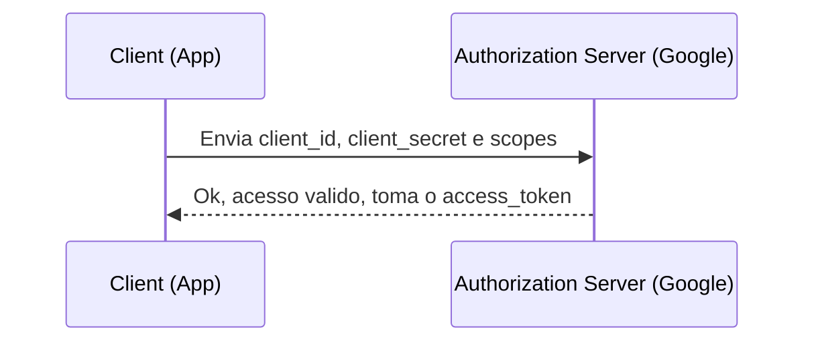

CreatedAt: 16-02-2026 19:36

Tags: #auth #oauth2

---
## Conceito Geral
Fluxo de autenticação geralmente utilizado para conversa entre duas aplicações, onde não existe a figura do usuário no processo.

---
## Referências
- [YT - Giuliana Bezerra](https://www.youtube.com/watch?v=68azMcqPpyo&t=1126s)