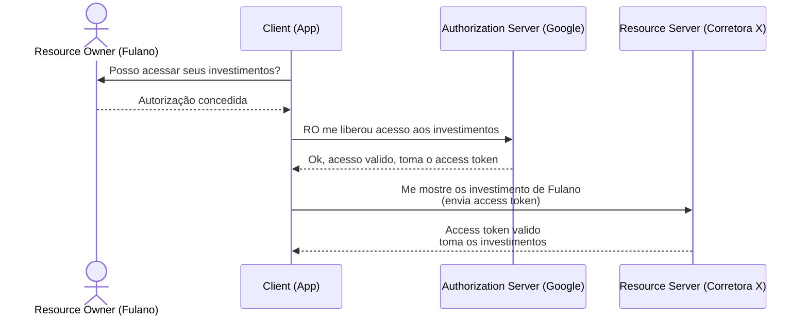

CreatedAt: 12-09-2025 09:08

Tags: #auth #authorization #oauth2 

---
## Conceito Geral
Atualmente é considerado o melhor protocolo para [[Autorização|autorização]] num panorama geral. Veio como uma solução moderna para conectar aplicações de forma segura, evitando transitar diretamente as credenciais dos usuários. Seu principal escopo de trabalho é na [[Autorização|autorização]].
Os principais componentes dos fluxos OAuth 2 são:
- [[Resource Owner]]
- [[Client]]
- [[Authotization Server]]
- [[Resource Server]]
- [[Access Token]]
- [[Refresh Token]]
Uma exemplificação simplificada do fluxo OAuth 2 (visto que ele possui varios [[O que são Grant Types|fluxos de autorização]]) utilizando um app de portifólio como exemplo:

---
## Referências
- [YT - Giuliana Bezerra](https://www.youtube.com/watch?v=68azMcqPpyo&t=1126s)