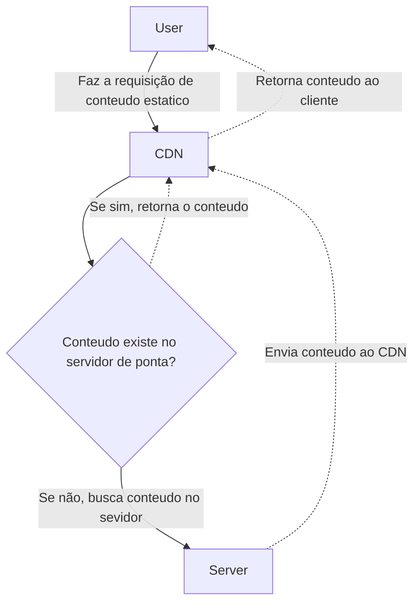

```mermaid
flowchart TD
User -- Faz a requisição de conteudo estatico --> CDN
CDN --> D{Conteudo existe no servidor de ponta?}
D -. Se sim, retorna o conteudo .-> CDN
D -- Se não, busca conteudo no sevidor --> Server
Server -. Envia conteudo ao CDN .-> CDN
CDN -. Retorna conteudo ao cliente .-> User
```

