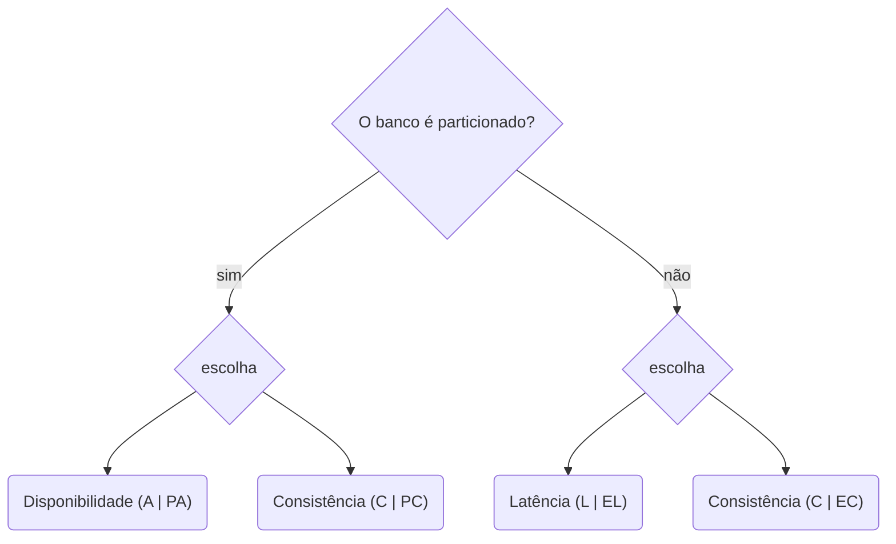

CreatedAt: 08-02-2026 20:29

Tags: #database #distributed-systems

---
## Conceito Geral
É a uma evolução mais refinada do [[CAP]] onde a pergunta inicial parte de se a propriedade do particionamento existe ou não. A partir da primeira escolha, ela nos encaminhará para uma segunda tomada de decisão, se houver P(particionamento) você terá que escolher entre A(disponibilidade) e C(consistência) se não houver (E) você terá que escolher entre L(latência) ou C(consistência).

Quando for escolher o banco verifique a classificação PACELC desse banco, lembrando que ele tem a configuração de particionada e não particionada.

---
## Referências
- [fidelissaouro.dev](https://fidelissauro.dev/pacelc/)
- [Renato Augusto](https://www.youtube.com/watch?v=bhw4-Kq_RPs)